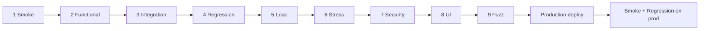

# Pre-go-live testing program (web)

**Scope:** Web storefront (Vercel) + FastAPI API (Render) — **not** mobile store release.  
**Gate:** Complete all nine test types on **staging** before production traffic. Re-run **smoke** and **regression** immediately after production deploy.

**Related:** [executive-summary.md](../audit/executive-summary.md) · [production-deployment.md](../deployment/production-deployment.md) · [operations/operations.md](../operations/operations.md)

**Runnable commands:** [nine-phase-runbook.md](./nine-phase-runbook.md) · API runner: [staging-api-runner.md](./staging-api-runner.md)

---

## Prerequisites (staging environment)

**First-time setup:** [deployment/staging-environment.md](../deployment/staging-environment.md) (branch `dev/staging`, Render + Vercel + DB).

| Requirement | Why |
|-------------|-----|
| **Staging API** on Render with `ENVIRONMENT=staging` | Safe Paystack test keys, no customer impact |
| **Staging frontend** on Vercel (dedicated project, branch `dev/staging`) | UI + API CORS aligned |
| **PostgreSQL** — **separate** Supabase project or Render DB | Never share production data |
| `DISABLE_OPENAPI=false` on staging | Export `/openapi.json` for tools |
| Paystack **test** keys (`sk_test_…`) | Checkout without live charges |
| `SENTRY_DSN` on staging (optional) | Catch failures during test runs |
| Secrets in Render/Vercel only — never in Git | Security baseline |

**Staging URLs (fill in after setup):**

| Service | URL |
|---------|-----|
| API base | `https://________________/api/v1` |
| Storefront | `https://________________` |
| OpenAPI | `https://________________/openapi.json` |
| Git branch | `dev/staging` |

---

## Recommended execution order

Run in this order where possible — later phases assume earlier gates passed.



| Phase | Types | Typical duration |
|-------|--------|------------------|
| **A — Fast gates** | 1 Smoke, 2 Functional | Hours |
| **B — Confidence** | 3 Integration, 4 Regression | 1–2 days |
| **C — Capacity & abuse** | 5 Load, 6 Stress, 7 Security, 9 Fuzz | 1–2 days |
| **D — Experience** | 8 UI | 1 day |
| **E — Launch** | Re-run 1 + 4 on production | 30 min |

---

## Master checklist

| # | Type | Staging done | Prod smoke | Owner | Automated |
|---|------|:------------:|:----------:|-------|-----------|
| 1 | [Smoke](#1-smoke-testing) | [ ] | [ ] | | Partial (CI + keepalive) |
| 2 | [Functional](#2-functional-testing) | [ ] | — | | Partial (pytest) |
| 3 | [Integration](#3-integration-testing) | [ ] | — | | Partial (pytest) |
| 4 | [Regression](#4-regression-testing) | [ ] | [ ] | | Yes (CI) |
| 5 | [Load](#5-load-testing) | [ ] | — | | Manual (k6) |
| 6 | [Stress](#6-stress-testing) | [ ] | — | | Manual (k6) |
| 7 | [Security](#7-security-testing) | [ ] | — | | Partial |
| 8 | [UI](#8-ui-testing) | [ ] | — | | Partial (Lighthouse) |
| 9 | [Fuzz](#9-fuzz-testing) | [ ] | — | | Manual (Schemathesis) |

---

## 1. Smoke testing

**Goal:** Prove the deployed stack is alive and critical paths respond — not deep correctness.

**What we test**

| Check | How | Pass |
|-------|-----|------|
| API liveness | `GET /health` | `200`, `status: healthy` |
| API readiness | `GET /health/ready` | `200`, `database: ok` |
| API root | `GET /` | `200` |
| OpenAPI (staging) | `GET /openapi.json` | `200` JSON |
| Auth surface | `POST /api/v1/auth/login` (invalid body) | `422` not `5xx` |
| Catalog | `GET /api/v1/products/` | `200` |
| Frontend home | Browser or `curl` storefront `/` | `200` |
| CORS preflight | `OPTIONS` from staging frontend origin | Not blocked |

**How we run it**

```bash
# API (replace STAGING_API with your host, no /api/v1 suffix for health)
curl -fsS "https://STAGING_API/health/ready"
curl -fsS "https://STAGING_API/health"
curl -fsS "https://STAGING_API/api/v1/products/?limit=1"

# Automated — local mirror of CI
.\scripts\ci-local.ps1 -BackendOnly
```

**Automation:** GitHub Actions `render-keepalive.yml` pings `/health/ready` every 10 minutes; `ci.yml` runs backend smoke via pytest on every push.

**Sign-off:** All checks green; no `5xx` on probes.

---

## 2. Functional testing

**Goal:** Verify each feature behaves correctly against requirements — single-service, business rules.

**What we test (API)**

| Area | Scenarios |
|------|-----------|
| **Auth** | Register → verify email → login → refresh → profile → logout |
| **2FA** | Setup → enable → login-2fa; Google OAuth + verify-2fa (if enabled) |
| **Catalog** | List, search, suggest, product detail, categories |
| **Cart** | Add, update qty, remove, merge guest cart |
| **Checkout** | Create order, apply coupon, tax/shipping rules |
| **Paystack** | Initialize → verify (test mode); webhook signature rejected when invalid |
| **Orders** | List, detail, invoice PDF (if enabled) |
| **Wishlist / reviews / returns** | CRUD happy paths |
| **Admin** | Staff vs admin RBAC — denied without permission |
| **Maintenance** | `MAINTENANCE_MODE` returns 503 except allowlisted webhook + health |

**How we run it**

| Method | Command / tool |
|--------|----------------|
| **Automated (backend)** | `cd backend && pytest tests/ -v` (97+ tests today) |
| **Manual / collection** | Postman or Bruno collection from staging OpenAPI |
| **Frontend units** | `cd frontend && npm test` (Vitest — client helpers, permissions) |

**Pass criteria:** All automated tests pass; manual checklist 100% for money paths (cart → Paystack test → order paid).

**Gap to close:** HTTP tests for admin CRUD, wishlist, returns, subscriptions (see [backend.md](../audit/backend.md)).

---

## 3. Integration testing

**Goal:** Validate cross-component flows — API + database + external services (Paystack, Supabase, email).

**What we test**

| Flow | Components |
|------|------------|
| **Checkout** | Cart → order → Paystack initialize → webhook → order `paid` |
| **Auth session** | Login → JWT → refresh → blacklist on logout |
| **Uploads** | Admin image → Supabase storage → URL on product |
| **Email** | Password reset triggers Resend (or disabled in staging) |
| **RLS** | Customer A cannot read customer B orders (Postgres only) |
| **Rate limits** | Redis sliding window on `/api/v1/admin` (when `REDIS_URL` set) |
| **Frontend + API** | Login on Vercel preview → authorized `apiFetchJsonAuth` calls |

**How we run it**

```bash
# Backend integration tests (today: SQLite in-memory)
cd backend && pytest tests/test_orders_paystack_flow.py tests/test_auth_e2e.py -v

# Target: Postgres service in CI (add job)
# DATABASE_URL=postgresql://... pytest tests/ -v
```

**Tools:** pytest + httpx `AsyncClient`; optional Testcontainers Postgres in CI.

**Pass criteria:** Paystack webhook test passes; order state consistent in DB; RLS denies cross-tenant access on Postgres staging.

**Gap to close:** CI job with real PostgreSQL + `tools/rls/rls_setup.py` (executive-summary P0-4).

---

## 4. Regression testing

**Goal:** Ensure new changes did not break existing behavior — full automated suite before merge/release.

**What we run**

| Layer | Command | When |
|-------|---------|------|
| Backend | `pytest tests/ --cov=app --cov-fail-under=50` | Every PR (`ci.yml`) |
| Backend lint | `ruff check app tests` | Every PR |
| Frontend | `npm run lint && npm run build && npm test` | Every PR |
| Path sync | `python scripts/check_api_path_sync.py` | Every PR |
| Security deps | `pip-audit` (hard fail), `npm audit` (advisory) | Every PR |
| Lighthouse a11y | `lighthouse.yml` on frontend PRs | PR touching `frontend/**` |
| Local all-in-one | `.\scripts\ci-local.ps1 -IncludeFrontend` | Before push |

**How we run it**

- Merge to `dev/develop` only when GitHub Actions is green.
- Enable branch protection: require **CI** + **Lighthouse** (frontend changes).

**Pass criteria:** All required checks green on the release commit; no new failures vs last green build.

---

## 5. Load testing

**Goal:** Measure normal expected traffic — latency and error rate under typical load.

**Targets (web go-live)**

| Metric | Target |
|--------|--------|
| API p95 (read) | < 200 ms |
| API p95 (checkout initialize) | < 500 ms |
| Error rate | < 0.1% |
| Concurrent users | Your expected peak (e.g. 50 VUs) |

**Scenarios (k6)**

| Script focus | Endpoints |
|--------------|-----------|
| Browse | `GET /products/`, `GET /products/search?q=oil` |
| Auth | `POST /auth/login` (test user pool) |
| Checkout path | Cart add → order create → Paystack initialize (test keys) |

**How we run it**

```bash
# Install: https://grafana.com/docs/k6/latest/set-up/install-k6/
export API_BASE=https://STAGING_HOST/api/v1
k6 run scripts/load/smoke-load.js
k6 run scripts/load/checkout-load.js   # needs TEST_IDENTIFIER + TEST_PASSWORD
```

**Pass criteria:** p95 within targets; zero `5xx`; Render CPU/memory acceptable.

**Note:** Run against **staging** only until targets met.

---

## 6. Stress testing

**Goal:** Find breaking point above normal load — recovery, rate limits, connection pool exhaustion.

**What we test**

| Scenario | Expectation |
|----------|-------------|
| Ramp 50 → 200 → 500 VUs over 10 min | Graceful 429s, not cascading 5xx |
| Spike (instant 300 VUs for 2 min) | Recovery within 5 min; `/health/ready` returns 200 after |
| Sustained admin dashboard | No OOM; Redis rate limiter active |
| Cold start (Render sleep) | First request slow but succeeds |

**How we run it**

- k6 with `stages` ramping beyond load-test VUs.
- Monitor Render metrics + Sentry during run.

**Pass criteria:** No data corruption; Paystack webhooks still accepted; DB connections recover; document max safe VUs.

---

## 7. Security testing

**Goal:** Find vulnerabilities — auth bypass, IDOR, injection, misconfiguration.

**What we test**

| Category | Tests |
|----------|-------|
| **Auth** | Invalid/expired JWT; refresh token reuse after logout |
| **IDOR** | User A accesses `GET /orders/{id}` for user B |
| **RBAC** | Staff without permission on admin routes → `403` |
| **Paystack** | Webhook without valid signature → rejected; optional IP allowlist |
| **Uploads** | Non-image MIME on review/admin upload → rejected |
| **Headers** | CSP, HSTS, `X-Frame-Options` on production frontend |
| **Secrets** | No keys in repo; `SECRET_KEY` strength in production |
| **Dependencies** | `pip-audit` (CI), `npm audit` (review highs) |

**How we run it**

| Tool | Use |
|------|-----|
| **pytest** | `tests/test_admin_permissions.py`, `tests/test_paystack_routes.py`, auth e2e |
| **OWASP ZAP** | Baseline scan against staging storefront + API |
| **Manual** | Admin cookie forgery attempt (should fail after JWT verify fix) |
| **CI** | Ruff, pip-audit, ESLint |

**Pass criteria:** No critical/high exploitable issues open; IDOR and webhook tests pass; ZAP report reviewed and accepted.

---

## 8. UI testing

**Goal:** Verify the storefront and admin UI work for real users — layout, flows, accessibility.

**What we test**

| Flow | Pages |
|------|-------|
| Shopper | `/`, `/shop`, `/product/[id]`, `/cart`, `/checkout`, `/checkout/success`, `/account` |
| Auth | Login, register, password reset, Google OAuth (if enabled) |
| Admin | `/system` orders, products, inventory (as admin user) |
| A11y | Lighthouse on `/`, `/shop`, `/account` (CI gate ≥ 0.9) |

**Note on storefront URLs:** Vercel Preview deployments are sometimes protected behind authentication. If your staging preview is gated, run UI/Lighthouse tests against a publicly accessible host instead (e.g. production storefront `https://sikapa.auralenx.com`) until you configure a dedicated staging storefront URL without protection.
| Responsive | Mobile + desktop breakpoints on checkout |

**How we run it**

| Method | Command |
|--------|---------|
| **Lighthouse CI** | Automatic on frontend PRs (`.github/workflows/lighthouse.yml`) |
| **Playwright (recommended)** | `npx playwright test` — add `frontend/e2e/` suite for phase 8 |
| **Manual** | Script: guest browse → login → add to cart → Paystack test card → order visible |

**Pass criteria:** Critical flows pass manual script; Lighthouse accessibility ≥ 0.9; no blocking visual/JS errors in console.

**Gap to close:** Add Playwright E2E for `/checkout` (not in Lighthouse URLs today).

---

## 9. Fuzz testing

**Goal:** Send malformed, unexpected, and random inputs to find crashes, 500s, and validation holes.

**What we test**

| Surface | Fuzz focus |
|---------|------------|
| **OpenAPI endpoints** | Random bodies, wrong types, boundary strings |
| **Auth** | Oversized passwords, unicode, SQL-like strings in login |
| **Query params** | `limit`, `offset`, `q` on search — negative/huge values |
| **Paystack webhook** | Malformed JSON, wrong event types |
| **Multipart** | Huge files, wrong extensions on uploads |

**How we run it**

```bash
# Schemathesis against staging OpenAPI (install: pip install schemathesis)
schemathesis run https://STAGING_HOST/openapi.json \
  --base-url=https://STAGING_HOST \
  --checks all \
  --hypothesis-max-examples=50

# Optional: httpx fuzz on specific routes with pytest-hypothesis
```

**Rules**

- Run only on **staging**.
- Use dedicated fuzz test accounts; never fuzz production.
- Stop if Paystack or email rate limits trigger.

**Pass criteria:** No unhandled `500` responses; validation returns `422`/`400`; no stack traces leaked to clients.

---

## Tooling summary

| Tool | Test types |
|------|------------|
| `curl` / GitHub Actions keepalive | Smoke |
| `pytest` + httpx | Functional, integration, regression |
| `k6` | Load, stress |
| OWASP ZAP | Security |
| Playwright | UI |
| Schemathesis | Fuzz (+ contract) |
| Lighthouse | UI (a11y) |
| `pip-audit` / `npm audit` | Security (deps) |

---

## After production deploy

Re-run minimum gates within 30 minutes:

1. **Smoke** — `GET /health/ready` on production API; storefront `/` loads.
2. **Regression** — confirm latest GitHub Actions run on release commit is green.
3. **Functional (manual)** — one real Paystack **test** or **live** checkout (as appropriate) with small amount.
4. **Sentry** — confirm events arrive; no spike in 5xx.

---

## Document history

| Date | Change |
|------|--------|
| June 1, 2026 | Initial nine-type program (web go-live) |
